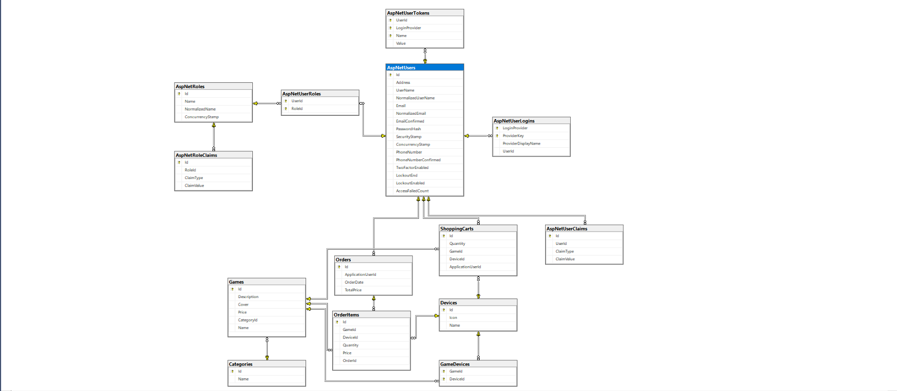

# 🎮 GameEngine Project (Game Store)

A web-based game management and e-commerce platform built with **ASP.NET Core MVC** and **Entity Framework Core**.  
The system provides features for browsing, managing, and purchasing games with role-based access control for **Admins** and **Users**, and includes **secure payment integration via Stripe**.

---

## 📖 Table of Contents
1. [System Overview](#system-overview)  
2. [Database Design](#database-design)  
3. [Models Description](#models-description)  
4. [Services Description](#services-description)  
5. [Settings](#settings)  
6. [Validation Attributes](#validation-attributes)  
7. [Package Dependencies](#package-dependencies)

---

## 1. System Overview
This project is a **Game Store application** that enables authenticated users to:
- Browse and search for games  
- Add games to a shopping cart  
- Place and track orders  
- Manage accounts and roles  
- **Make secure payments via Stripe checkout**  

Admins have access to management tools for games, categories, devices, and orders.

---

## 2. Database Design
The system database is designed around the following core entities:

- **Games**: Name, description, price, cover image, category, supported devices  
- **Categories**: Game genres (e.g., Action, Racing)  
- **Devices**: Platforms (e.g., PC, PS5)  
- **GameDevices**: Many-to-many relation between games and devices  
- **ShoppingCart**: Stores temporary user-selected games and devices  
- **Orders**: Completed purchases with user details and totals  
- **OrderItems**: Items within each order (game, device, quantity, price)  
- **ApplicationUser**: Custom user model with `Address` field  

 

---

## 3. Models Description
- **ApplicationUser.cs**  
  Extends `IdentityUser` with:  
  - `Address`: Required string for user address  

- **BaseEntity.cs**  
  Common base for Category, Device, and Game:  
  - `Id`: Primary key  
  - `Name`: Required (max 250 chars)  

- **Category.cs**  
  Inherits from `BaseEntity`:  
  - `Games`: One-to-many relationship  

- **Device.cs**  
  Inherits from `BaseEntity`:  
  - `Icon`: File/path string (max 50 chars)  

- **Game.cs**  
  Inherits from `BaseEntity`:  
  - `Description`: Max 2500 chars  
  - `Cover`: File path (max 500 chars)  
  - `Price`: Decimal  
  - `CategoryId`: FK  
  - `Devices`: Many-to-many via `GameDevice`  

- **GameDevice.cs**  
  Linking table:  
  - `GameId`, `DeviceId` (FKs)  
  - Navigation: `Game`, `Device`  

- **ShoppingCart.cs**  
  Per-user cart:  
  - `GameId`, `DeviceId`, `Quantity`  
  - `ApplicationUserId` (FK)  

- **Order.cs**  
  Completed order:  
  - `ApplicationUserId`  
  - `OrderDate`, `TotalPrice`  
  - `Items`: Collection of `OrderItem`  

- **OrderItem.cs**  
  Item in an order:  
  - `GameId`, `DeviceId`  
  - `Quantity`, `Price`  
  - `OrderId` (FK)  

---

## 4. Services Description
- **AccountService**  
  Handles authentication & roles.  
  - `RegisterUserAsync`, `LoginAsync`, `LogoutAsync`  
  - `SeedRolesAndAdminAsync`  
  - `GetById`  

- **CategoriesService**  
  Manage categories.  
  - `GetSelectList`, `GetAll`, `GetByName`  
  - `Create`, `Update`  

- **DevicesService**  
  Manage devices.  
  - `GetSelectList`, `GetSelectListByGameId`  

- **GamesService**  
  CRUD operations for games.  
  - `GetAll`, `GetById`, `GetByCategoryId`, `GetByName`  
  - `Create`, `Update`, `Remove`  
  - Includes cover image upload + device assignment  

- **ShoppingCartService**  
  Cart logic.  
  - `AddToCart`, `GetCartItems`  
  - `RemoveFromCart`, `ClearCart`  
  - `GetCartTotal`  

- **OrdersAndItemsService**  
  Handles checkout & order management.  
  - `Create`: Converts cart into order  
  - `GetAll`: Lists orders  
  - `GetItemsByOrderId`  

---

## 5. Settings
**FileSettings.cs**  
- `ImagesPath`: Upload path  
- `AllowedExtensions`: .jpeg, .jpg, .png  
- `MaxFileSizeInMB`: 1 MB  

---

## 6. Validation Attributes
- **AllowedExtensionsAttribute**: Validates file type  
- **MaxFileSizeAttribute**: Restricts file size to 1 MB  

---

## 7. Package Dependencies
- **Microsoft.AspNetCore.Identity.EntityFrameworkCore**  
  Authentication, roles, password hashing, session management  

- **Stripe.net**  
  Integrated to handle **secure payment processing during checkout**  
  **Note!**: Put your Stripe Keys in appsettings.json file   

---

## 📌 Author
Developed by **[Mina Magdy]**  
